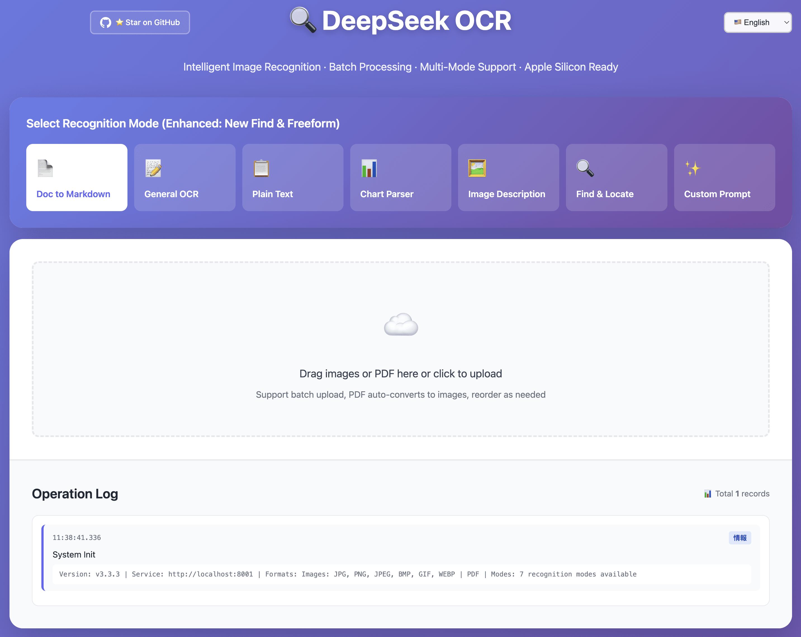

# 🔍 DeepSeek-OCR-WebUI
[Visit Application →](https://deepseek-ocr.aws.xin/)

<div align="center">

**🌐 [English](./README.md) | [简体中文](./README_zh-CN.md) | [繁體中文](./README_zh-TW.md) | [日本語](./README_ja.md)**

[](./CHANGELOG.md)
[](./docker-compose.yml)
[](./LICENSE)
[](#multilingual-support)

Intelligent OCR System · Batch Processing · Multi-Mode Support · Bounding Box Visualization

[Features](#features) • [Quick Start](#quick-start) • [Version History](#version-history) • [Documentation](#documentation) • [Contributing](#contributing)

</div>

---

## 🎉 Major Update: Apple Silicon Support!

**🍎 Now fully supports Mac M1/M2/M3/M4 with native MPS acceleration!**

DeepSeek-OCR-WebUI v3.3 brings native Apple Silicon support, enabling Mac users to run high-performance OCR locally with:
- ✅ **Native MPS Backend** - Metal Performance Shaders acceleration
- ✅ **Easy Setup** - One-command conda environment installation
- ✅ **Private Deployment** - Run completely offline on your Mac
- ✅ **Fast Inference** - ~3s per image on M3 Pro

👉 [Jump to Mac Deployment Guide](#-option-2-mac-native-deployment-apple-silicon)

---

## 📚 Complete API Documentation Available!

**NEW: Comprehensive API guide with production-ready examples**

- 🔌 **[View Full API Documentation →](./API.md)**
- 4 real-world scenarios (invoice extraction, batch processing, PDF handling)
- Multi-language clients (Python, JavaScript, Go, TypeScript)
- Best practices & performance optimization
- 8+ common troubleshooting solutions

Perfect for integrating OCR into your applications!

---

## 📖 Introduction

DeepSeek-OCR-WebUI is an intelligent image recognition web application based on the DeepSeek-OCR model, providing an intuitive user interface and powerful recognition capabilities.

### 🖼️ UI Preview

<div align="center">



**Modern user interface with multilingual support, batch processing, and bounding box visualization**

</div>

### 📈 Star History

<div align="center">


**Star growth over time - Help us grow! ⭐**

</div>

### ✨ Core Highlights

- 🎯 **7 Recognition Modes** - Document, OCR, Chart, Find, Freeform, etc.
- 🖼️ **Bounding Box Visualization** - Find mode automatically annotates positions
- 📦 **Batch Processing** - Support for multiple image sequential recognition
- 📄 **PDF Support** - Upload PDF files, automatically convert to images
- 🎨 **Modern UI** - Cool gradient backgrounds and animation effects
- 🌐 **Multilingual Support** - Simplified Chinese, Traditional Chinese, English, Japanese
- 🍎 **Apple Silicon Support** - Native MPS acceleration for Mac M1/M2/M3/M4
- 🐳 **Docker Deployment** - One-click startup, ready to use
- ⚡ **GPU Acceleration** - High-performance inference based on NVIDIA GPU
- 🌏 **ModelScope Fallback** - Auto-switch to ModelScope when HuggingFace is unavailable

---

## 🚀 Features

### 7 Recognition Modes

| Mode | Icon | Description | Use Cases |
|------|------|-------------|-----------|
| **Doc to Markdown** | 📄 | Preserve format and layout | Contracts, papers, reports |
| **General OCR** | 📝 | Extract all visible text | Image text extraction |
| **Plain Text** | 📋 | Pure text without format | Simple text recognition |
| **Chart Parser** | 📊 | Recognize charts and formulas | Data charts, math formulas |
| **Image Description** | 🖼️ | Generate detailed descriptions | Image understanding, accessibility |
| **Find & Locate** ⭐ | 🔍 | Find and annotate positions | Invoice field locating |
| **Custom Prompt** ⭐ | ✨ | Customize recognition needs | Flexible recognition tasks |

### 📄 PDF Support (New in v3.2)

DeepSeek-OCR-WebUI now supports PDF file uploads! When you upload a PDF file, it automatically converts each page to a separate image, maintaining all subsequent processing logic (OCR recognition, batch processing, etc.).

<div align="center">


**PDF upload and automatic conversion to images - Each page becomes a separate image for processing**

</div>

**Key Features**:
- **Multi-page PDF Conversion**: Automatically converts each page to a separate image
- **Real-time Progress**: Shows conversion progress page by page
- **Drag & Drop**: Support drag & drop PDF upload
- **Find Mode**: PDF support in Find mode (uses first page automatically)
- **Format Validation**: Automatic file type detection and error prompts
- **Seamless Integration**: Converted images follow the same processing pipeline as regular images

### 🌏 ModelScope Auto-Fallback (New in v3.2)

- **Auto-Switch**: Automatically switches to ModelScope when HuggingFace is unavailable
- **Smart Detection**: Intelligently detects network errors and timeouts
- **China-Friendly**: Seamless experience for users in mainland China
- **5-minute Timeout**: Configurable timeout for model loading

### 🎨 Find Mode Features

**Left-Right Split Layout**:
```
┌──────────────────────┬─────────────────────────────┐
│   Left: Control Panel │    Right: Result Display    │
├──────────────────────┼─────────────────────────────┤
│ 📤 Image Upload      │ 🖼️ Result Image (with boxes) │
│ 🎯 Search Input      │ 📊 Statistics               │
│ 🚀 Action Buttons    │ 📝 Recognition Text         │
│                      │ 📦 Match List                │
└──────────────────────┴─────────────────────────────┘
```

**Bounding Box Visualization**:
- 🟢 Colorful neon border auto-annotation
- 🎨 6 colors in rotation
- 📍 Precise coordinate positioning
- 🔄 Responsive auto-redraw

**Feature Demo**:

<div align="center">


**Find & Locate mode in action: Upload on left, auto-annotated results on right**

</div>

---

## 🌐 Multilingual Support

### Supported Languages

- 🇨🇳 **Simplified Chinese** (zh-CN)
- 🇹🇼 **Traditional Chinese** (zh-TW)
- 🇺🇸 **English** (en-US) - Default
- 🇯🇵 **Japanese** (ja-JP)

### How to Switch Language

**Web UI**:
1. Click the language selector in the top-right corner
2. Select your desired language
3. Interface switches immediately, settings auto-save

---

## 🐳 Docker Hub - Quick Start (Recommended)

**🎉 Pre-built all-in-one image available on Docker Hub!**

No need to build from source - just pull and run:

```bash
# Pull the image
docker pull neosun/deepseek-ocr:latest

# Run the container
docker run -d \
  --name deepseek-ocr \
  --gpus all \
  -p 8001:8001 \
  --shm-size=8g \
  neosun/deepseek-ocr:latest

# Access the service
# Web UI: http://localhost:8001
# API: http://localhost:8001/ocr
```

**Image Features**:
- ✅ All-in-one - Includes all dependencies and pre-downloaded model (~20GB)
- ✅ No waiting - Ready to use immediately, no model download needed
- ✅ Full features - All API endpoints and Web UI included
- ✅ Production ready - Fully tested and verified

📖 **Full Docker Hub Guide**: [DOCKER_HUB.md](./DOCKER_HUB.md)

---

## 🔌 API & MCP Support

### REST API
DeepSeek-OCR provides a complete REST API for programmatic access:

```python
import requests

# Simple OCR (single image)
with open("image.png", "rb") as f:
    response = requests.post(
        "http://localhost:8001/ocr",
        files={"file": f},
        data={"prompt_type": "ocr"}
    )
    print(response.json()["text"])

# PDF OCR (all pages) ⭐ NEW
with open("document.pdf", "rb") as f:
    response = requests.post(
        "http://localhost:8001/ocr-pdf",
        files={"file": f},
        data={"prompt_type": "document"},
        timeout=600
    )
    result = response.json()
    print(result["merged_text"])  # Get all pages merged
```

**Available Endpoints**:
- `GET /health` - Health check
- `POST /ocr` - Single image OCR
- `POST /ocr-pdf` - PDF OCR (all pages) ⭐ NEW
- `POST /pdf-to-images` - Convert PDF to images

📖 **Full API Documentation**: [API.md](./API.md)

### MCP (Model Context Protocol)
Enable AI assistants like Claude Desktop to use OCR directly:

```json
{
  "mcpServers": {
    "deepseek-ocr": {
      "command": "python",
      "args": ["/path/to/mcp_server.py"]
    }
  }
}
```

📖 **MCP Setup Guide**: [MCP_SETUP.md](./MCP_SETUP.md)

---

## 📦 Quick Start

### Prerequisites

**For Docker (Recommended)**:
- Docker & Docker Compose
- NVIDIA GPU + Drivers (for GPU acceleration)
- 8GB+ RAM
- 20GB+ Disk Space

**For Mac (Apple Silicon)**:
- macOS with Apple Silicon (M1/M2/M3/M4)
- Python 3.11+
- 16GB+ RAM (recommended)
- 20GB+ Disk Space

**For Linux (Native)**:
- Python 3.11+
- NVIDIA GPU + CUDA (optional, for acceleration)
- 8GB+ RAM
- 20GB+ Disk Space

---

### 🐳 Option 1: Docker Deployment (Linux/Windows)

**Best for**: Linux servers with NVIDIA GPU, production environments

```bash
# 1. Clone repository
git clone https://github.com/neosun100/DeepSeek-OCR-WebUI.git
cd DeepSeek-OCR-WebUI

# 2. Start service
docker compose up -d

# 3. Wait for model loading (about 1-2 minutes)
docker logs -f deepseek-ocr-webui

# 4. Access Web UI
# The service listens on all network interfaces (0.0.0.0:8001)
# Choose the appropriate access method:
#
# - Local access: http://localhost:8001
# - LAN access: http://<server-ip>:8001
# - Domain access: http://<your-domain>:8001 (if configured)
#
# Example: If your server IP is 192.168.1.100, use:
# http://192.168.1.100:8001
```

**Access Methods**:
- **Local Machine**: `http://localhost:8001`
- **Remote Server (No Domain)**: `http://<服务器IP地址>:8001`
  - Find your IP: `hostname -I` or `ip addr show`
  - Example: If IP is `192.168.1.100`, access `http://192.168.1.100:8001`
- **With Domain**: `http://<your-domain>:8001` or `https://<your-domain>`
  - Configure your reverse proxy (nginx/caddy) to forward to `localhost:8001`

---

### 🍎 Option 2: Mac Native Deployment (Apple Silicon)

**Best for**: Mac M1/M2/M3/M4 users, local development

**⚠️ Important**: Always use a conda virtual environment to avoid dependency conflicts.

#### Step 1: Install Dependencies

```bash
# Clone repository
git clone https://github.com/neosun100/DeepSeek-OCR-WebUI.git
cd DeepSeek-OCR-WebUI

# Create and activate conda environment (REQUIRED)
conda create -n deepseek-ocr-mlx python=3.11
conda activate deepseek-ocr-mlx

# Install PyTorch with MPS support
pip install torch torchvision

# Install required packages
pip install transformers==4.46.3 tokenizers==0.20.3
pip install fastapi uvicorn PyMuPDF Pillow
pip install einops addict easydict matplotlib

# Or install all dependencies at once
pip install -r requirements-mac.txt

# Verify installation (optional)
./verify_mac_env.sh
```

#### Step 2: Start Service

```bash
# IMPORTANT: Always activate the conda environment first
conda activate deepseek-ocr-mlx

# Start service (auto-detects MPS backend)
./start.sh

# Or manually
python web_service_unified.py
```

#### Step 3: Access Web UI

**Access Methods**:
- **Local Machine**: `http://localhost:8001`
- **Remote Server**: `http://<服务器IP>:8001`
  - Find IP: `ifconfig | grep "inet "` or `ip addr show`
  - Example: If IP is `192.168.1.100`, access `http://192.168.1.100:8001`
- **With Domain**: Configure reverse proxy to point to `localhost:8001`

**Note**: First run will download ~7GB model, please be patient.

---

### 🐧 Option 3: Linux Native Deployment

**Best for**: Linux servers, custom configurations

#### With NVIDIA GPU:

```bash
# Install PyTorch with CUDA
pip install torch torchvision --index-url https://download.pytorch.org/whl/cu118

# Install dependencies
pip install transformers==4.46.3 tokenizers==0.20.3
pip install fastapi uvicorn PyMuPDF Pillow
pip install einops addict easydict matplotlib

# Start service (auto-detects CUDA backend)
./start.sh
```

#### Without GPU (CPU only):

```bash
# Install PyTorch CPU version
pip install torch torchvision

# Install dependencies
pip install transformers==4.46.3 tokenizers==0.20.3
pip install fastapi uvicorn PyMuPDF Pillow
pip install einops addict easydict matplotlib

# Start service (auto-detects CPU backend)
./start.sh
```

---

### ✅ Verify Installation

```bash
# Check container status (Docker)
docker compose ps

# Check health status
curl http://localhost:8001/health

# Expected response:
# {
#   "status": "healthy",
#   "backend": "mps",  # or "cuda" or "cpu"
#   "platform": "Darwin",  # or "Linux"
#   "model_loaded": true
# }
```

---

### 🔧 Platform Detection

The service automatically detects your platform and uses the optimal backend:

| Platform | Backend | Acceleration | Auto-Detected |
|----------|---------|--------------|---------------|
| Mac M1/M2/M3/M4 | MPS | Metal GPU | ✅ Yes |
| Linux + NVIDIA GPU | CUDA | CUDA GPU | ✅ Yes |
| Linux (CPU only) | CPU | None | ✅ Yes |
| Docker | CUDA | CUDA GPU | ✅ Yes |

**Force specific backend** (optional):
```bash
FORCE_BACKEND=mps ./start.sh   # Force MPS (Mac only)
FORCE_BACKEND=cuda ./start.sh  # Force CUDA (Linux+GPU)
FORCE_BACKEND=cpu ./start.sh   # Force CPU (any platform)
# http://localhost:8001
```

### Verify Installation

```bash
# Check container status
docker compose ps

# Check health status
curl http://localhost:8001/health

# View logs
docker logs deepseek-ocr-webui
```

---

## 📊 Version History

### v3.3.1 (2025-12-16) - BFloat16 Compatibility Fix

**🐛 Bug Fixes**:
- ✅ Fixed "Input type (c10::BFloat16) and bias type (float) should be the same" error ([#30](https://github.com/neosun100/DeepSeek-OCR-WebUI/issues/30))
- ✅ Auto-detect GPU compute capability and select optimal dtype
- ✅ Fallback to float16 for older GPUs (RTX 20xx, GTX 10xx, etc.)

**🔧 Technical Details**:
- GPUs with compute capability >= 8.0 (RTX 30xx, A100, etc.) use bfloat16
- Older GPUs automatically use float16 for compatibility
- No manual configuration required - fully automatic

---

### v3.3 (2025-11-05) - Apple Silicon Support & Multi-Platform

**🍎 Apple Silicon Support**:
- ✅ Native MPS (Metal Performance Shaders) backend for Mac M1/M2/M3/M4
- ✅ Automatic platform detection and backend selection
- ✅ Optimized float32 precision for MPS compatibility
- ✅ ~7GB model with automatic download and caching

**🌍 Multi-Platform Architecture**:
- ✅ Unified backend interface (MPS/CUDA/CPU)
- ✅ Smart platform detection (Mac/Linux/Docker)
- ✅ Independent backend implementations (no conflicts)
- ✅ Universal startup script (`./start.sh`)

**🔧 Technical Improvements**:
- ✅ Model revision: `1e3401a3d4603e9e71ea0ec850bfead602191ec4` (MPS support)
- ✅ Transformers 4.46.3 compatibility
- ✅ Fixed LlamaFlashAttention2 import issues
- ✅ Unified model inference interface across platforms

**📚 Documentation**:
- ✅ Multi-platform deployment guide
- ✅ Platform compatibility documentation
- ✅ Verification tools (`verify_platform.sh`)

---

### v3.2 (2025-11-04) - PDF Support & ModelScope Fallback

**📄 New Features**:
- ✅ PDF upload support (auto-convert to images)
- ✅ Multi-page PDF conversion with real-time progress
- ✅ Drag & drop PDF upload
- ✅ ModelScope auto-fallback (when HuggingFace unavailable)
- ✅ Smart network error detection and retry

**🐛 Bug Fixes**:
- ✅ Fixed PDF conversion progress logging
- ✅ Fixed button text duplication in i18n
- ✅ Fixed system initialization log information

**🔧 Technical Improvements**:
- ✅ PyMuPDF integration for high-quality PDF conversion (144 DPI)
- ✅ Async PDF processing for real-time progress
- ✅ Enhanced error handling and logging

---

### v3.1 (2025-10-22) - Multilingual & Bug Fixes

**🌐 New Features**:
- ✅ Added multilingual support (Simplified Chinese, Traditional Chinese, English, Japanese)
- ✅ Language selector UI component
- ✅ Localization persistence storage
- ✅ Multilingual documentation (README)

**🐛 Bug Fixes**:
- ✅ Fixed mode switching issues
- ✅ Fixed bounding boxes exceeding image boundaries
- ✅ Optimized image container layout
- ✅ Added rendering delay for alignment

**🎨 UI Optimization**:
- ✅ Centered image display
- ✅ Responsive bounding box redraw
- ✅ Language switcher integration

---

### v3.0 (2025-10-22) - Find Mode & Split Layout

**✨ Major Updates**:
- ✅ New Find mode (find & locate)
- ✅ Dedicated left-right split layout
- ✅ Canvas bounding box visualization
- ✅ Colorful neon annotation effects

**🔧 Technical Improvements**:
- ✅ transformers engine (replacing vLLM)
- ✅ Precise coordinate conversion algorithm
- ✅ Responsive design optimization

---

## 📖 Documentation

### User Documentation

- 📘 [Quick Start Guide](./QUICK_START.md)
- 📗 [Find Mode Guide](./FIND_MODE_V2_GUIDE.md)
- 📙 [Enhanced Features](./ENHANCED_FEATURES.md)
- 📕 [Bug Fix Summary](./BUGFIX_SUMMARY.md)

### Technical Documentation

- 🔧 [Deployment Summary](./DEPLOYMENT_SUMMARY.md)
- 📝 [Changelog](./CHANGELOG.md)
- 🌐 [I18n Implementation](./I18N_IMPLEMENTATION.md)

---

## 🎯 Usage Examples

### Find Mode Example

```bash
Scenario: Find "Total" amount in invoice

Steps:
1. Select "🔍 Find & Locate" mode
2. Upload invoice image
3. Enter search term: Total
4. Click "🚀 Start Search"

Results:
✓ "Total" marked with green border on image
✓ Shows 1-2 matches found
✓ Provides precise coordinate information
```

### Batch Processing Example

```bash
Scenario: Batch recognize 20 contracts

Steps:
1. Select "📄 Doc to Markdown" mode
2. Drag and upload 20 images
3. Adjust order (optional)
4. Click "🚀 Start Recognition"

Results:
✓ Process each image sequentially
✓ Real-time progress display
✓ Auto-merge all results
✓ One-click copy or download
```

---

## 🔧 Configuration

### Environment Variables

```bash
# docker-compose.yml
API_HOST=0.0.0.0              # Listen address
MODEL_NAME=deepseek-ai/DeepSeek-OCR  # Model name
CUDA_VISIBLE_DEVICES=0        # GPU device
```

### Performance Tuning

```yaml
# Memory configuration
shm_size: "8g"                # Shared memory

# GPU configuration
deploy:
  resources:
    reservations:
      devices:
        - driver: nvidia
          count: 1
          capabilities: [gpu]
```

---

## 🤝 Contributing

Contributions welcome! Please check the [Contributing Guide](./CONTRIBUTING.md).

### How to Contribute

1. Fork this repository
2. Create feature branch (`git checkout -b feature/AmazingFeature`)
3. Commit changes (`git commit -m 'Add some AmazingFeature'`)
4. Push to branch (`git push origin feature/AmazingFeature`)
5. Open Pull Request

---

## 📞 Support

### Having Issues?

1. Check [Troubleshooting](./TROUBLESHOOTING.md)
2. Check [Known Issues](./KNOWN_ISSUES.md)
3. Submit an [Issue](https://github.com/neosun100/DeepSeek-OCR-WebUI/issues)

### Feature Suggestions?

1. Check [Roadmap](./ROADMAP.md)
2. Submit a [Feature Request](https://github.com/neosun100/DeepSeek-OCR-WebUI/issues/new?template=feature_request.md)

---

## 📱 Follow Us

<div align="center">


**Scan to get more information**

</div>

---

## 📄 License

This project is licensed under the [MIT License](./LICENSE).

---

## 🙏 Acknowledgments

- [DeepSeek-AI](https://github.com/deepseek-ai) - DeepSeek-OCR model
- [deepseek_ocr_app](https://github.com/rdumasia303/deepseek_ocr_app) - Reference project
- All contributors and users

---

## 🔗 Related Links

- 🏠 [Project Home](https://github.com/neosun100/DeepSeek-OCR-WebUI)
- 📖 [Full Documentation](https://github.com/neosun100/DeepSeek-OCR-WebUI/wiki)
- 🐛 [Issue Tracker](https://github.com/neosun100/DeepSeek-OCR-WebUI/issues)
- 💬 [Discussions](https://github.com/neosun100/DeepSeek-OCR-WebUI/discussions)

---

<div align="center">

**⭐ If this project helps you, please give it a Star! ⭐**

Made with ❤️ by [neosun100](https://github.com/neosun100)

DeepSeek-OCR-WebUI v3.3 | © 2025

</div>
