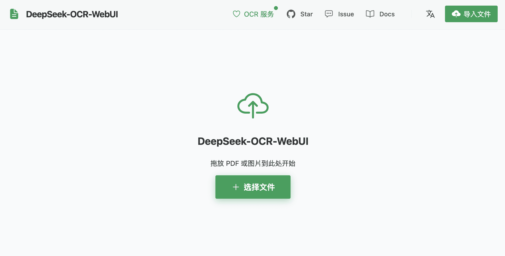
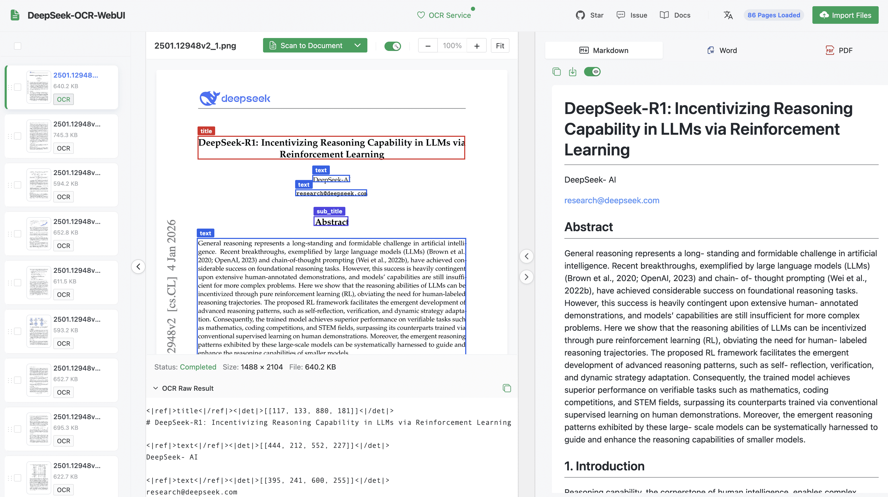
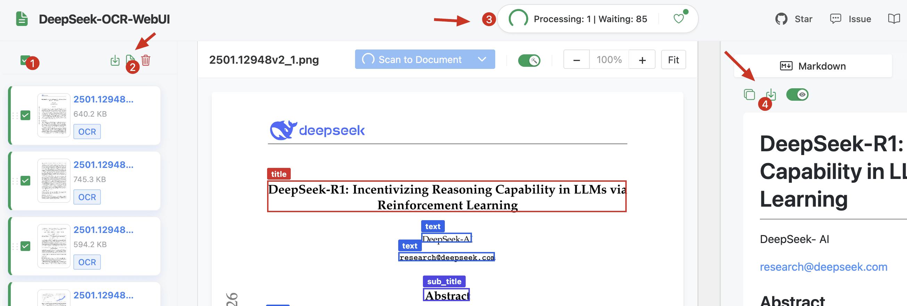

# 🔍 DeepSeek-OCR-WebUI

[アプリにアクセス →](https://deepseek-ocr.aws.xin/)

<div align="center">

**🌐 [English](./README.md) | [简体中文](./README_zh-CN.md) | [繁體中文](./README_zh-TW.md) | [日本語](./README_ja.md)**

[](./CHANGELOG.md)
[](https://hub.docker.com/r/neosun/deepseek-ocr)
[](./LICENSE)
[](https://vuejs.org/)
[](https://www.typescriptlang.org/)

**インテリジェント OCR システム · Vue 3 モダン UI · バッチ処理 · マルチモード対応**

[機能](#-機能) • [クイックスタート](#-クイックスタート) • [スクリーンショット](#-スクリーンショット) • [コントリビューター](#-コントリビューター)

</div>

---

## 🎉 v3.6 アップデート：バックエンド並行処理とレート制限！

**🚀 スマートなキュー管理とレート制限によるパフォーマンス最適化！**

### ✨ v3.6 の新機能

- ⚡ **バックエンド並行処理最適化** - ThreadPoolExecutor によるノンブロッキング推論
- 🔒 **レート制限** - クライアントごと・IPごとのリクエスト制限（X-Client-ID ヘッダー対応）
- 📊 **キュー管理** - リアルタイムのキュー状態と位置追跡
- 🏥 **強化されたヘルス API** - キュー深度、状態（healthy/busy/full）、レート制限情報
- 🌐 **新言語追加** - 繁体字中国語（zh-TW）と日本語（ja-JP）を追加
- 🎯 **429 エラー処理** - キュー満杯またはレート制限時の適切な処理

**🙏 コントリビューター：** [@cloudman6](https://github.com/cloudman6) ([PR #41](https://github.com/neosun100/DeepSeek-OCR-WebUI/pull/41))

---

## 🎉 v3.5 メジャーアップデート：全く新しい Vue 3 フロントエンド！

**🚀 モダンな Vue 3 + TypeScript アーキテクチャによる完全な UI 刷新！**

<div align="center">

| ホームページ | 処理ページ |
|:------------:|:----------:|
|  |  |

</div>

### ✨ v3.5 の新機能

- 🎨 **全く新しい Vue 3 UI** - Naive UI コンポーネントによるモダンでレスポンシブなデザイン
- ⚡ **TypeScript サポート** - 完全な型安全性と優れた開発体験
- 📦 **Dexie.js データベース** - オフラインページ管理のためのローカル IndexedDB
- 🔄 **リアルタイム処理キュー** - キュー管理付きの視覚的 OCR 進捗
- 🏥 **ヘルスチェックシステム** - 視覚的インジケーター付きのバックエンド状態監視
- 📄 **強化された PDF サポート** - ページごとの処理によるスムーズな PDF レンダリング
- 🌐 **i18n 対応** - 組み込みの国際化（EN/CN/TW/JP）
- 🧪 **E2E テスト** - 包括的な Playwright テストカバレッジ

---

## 👥 コントリビューター

<div align="center">

### 🌟 素晴らしいコントリビューターに特別な感謝を！🌟

</div>

このプロジェクトは優れたコラボレーションの成果です。Vue 3 フロントエンドは [PR #34](https://github.com/neosun100/DeepSeek-OCR-WebUI/pull/34) の成功したマージを通じて開発されました。

<table>
<tr>
<td align="center">
<a href="https://github.com/cloudman6">

<br />
<sub><b>CloudMan</b></sub>
</a>
<br />
<sub>🏆 Vue 3 フロントエンドリード開発者</sub>
<br />
<sub>164 コミット · 完全な UI 書き換え</sub>
</td>
<td align="center">
<a href="https://github.com/neosun100">

<br />
<sub><b>neosun100</b></sub>
</a>
<br />
<sub>🎯 プロジェクトメンテナー</sub>
<br />
<sub>バックエンド · Docker · 統合</sub>
</td>
</tr>
</table>

> 💡 **Vue 3 フロントエンドについて**：[@cloudman6](https://github.com/cloudman6) は、包括的な E2E テスト、モダンな UI コンポーネント、本番環境対応のアーキテクチャを含む 164 コミットで、優れた Vue 3 + TypeScript フロントエンドを貢献しました。このコラボレーションにより、DeepSeek-OCR-WebUI はプロフェッショナルグレードのアプリケーションに変貌しました！

---

## 📖 はじめに

DeepSeek-OCR-WebUI は、DeepSeek-OCR モデルを搭載したインテリジェントな文書認識 Web アプリケーションです。画像や PDF を高精度で構造化テキストに変換するための、モダンで直感的なインターフェースを提供します。

### ✨ コアハイライト

| 機能 | 説明 |
|------|------|
| 🎯 **7 つの認識モード** | ドキュメント、OCR、チャート、検索、フリーフォームなど |
| 🖼️ **バウンディングボックス可視化** | 自動位置注釈付きの検索モード |
| 📦 **バッチ処理** | 複数の画像/ページを順次処理 |
| 📄 **PDF サポート** | PDF をアップロードし、自動的に画像に変換 |
| 🎨 **モダンな Vue 3 UI** | Naive UI によるレスポンシブデザイン |
| 🌐 **多言語** | EN、简体中文、繁體中文、日本語 |
| 🍎 **Apple Silicon** | M1/M2/M3/M4 のネイティブ MPS アクセラレーション |
| 🐳 **Docker 対応** | ワンコマンドデプロイ |
| ⚡ **GPU アクセラレーション** | NVIDIA CUDA サポート |

---

## 🚀 機能

### 7 つの認識モード

| モード | アイコン | 説明 | ユースケース |
|--------|:--------:|------|--------------|
| **Doc to Markdown** | 📄 | フォーマットとレイアウトを保持 | 契約書、論文、レポート |
| **一般 OCR** | 📝 | すべての可視テキストを抽出 | 画像テキスト抽出 |
| **プレーンテキスト** | 📋 | フォーマットなしの純粋なテキスト | シンプルなテキスト認識 |
| **チャートパーサー** | 📊 | チャートと数式を認識 | データチャート、数学公式 |
| **画像説明** | 🖼️ | 詳細な説明を生成 | 画像理解 |
| **検索＆位置特定** | 🔍 | 位置を検索して注釈 | 請求書フィールドの位置特定 |
| **カスタムプロンプト** | ✨ | 認識ニーズをカスタマイズ | 柔軟なタスク |

### 🆕 Vue 3 フロントエンド機能

```
┌─────────────────────────────────────────────────────────────┐
│  📁 ページサイドバー      │  📄 ドキュメントビューア        │
│  ├─ サムネイルリスト      │  ├─ 高解像度画像表示            │
│  ├─ ドラッグ＆ドロップ    │  ├─ OCR オーバーレイ切替        │
│  ├─ バッチ選択            │  ├─ ズームコントロール          │
│  └─ クイックアクション    │  └─ ステータスインジケーター    │
├─────────────────────────────────────────────────────────────┤
│  🔄 処理キュー            │  📝 結果パネル                  │
│  ├─ リアルタイム進捗      │  ├─ Markdown プレビュー         │
│  ├─ キャンセル/リトライ   │  ├─ Word/PDF エクスポート       │
│  └─ ヘルス監視            │  └─ クリップボードにコピー      │
└─────────────────────────────────────────────────────────────┘
```

---

## 🖼️ スクリーンショット

### ホームページ
<div align="center">


*すべての機能にすばやくアクセスできるクリーンでモダンなランディングページ*

</div>

### 処理インターフェース
<div align="center">


*サイドバー、ビューア、結果パネルを備えたフル機能のドキュメント処理*

</div>

### クイックスタートガイド
<div align="center">



*操作手順：ファイルをインポート → ページを選択 → OCR モードを選択 → 結果を取得*

</div>

---

## 📦 クイックスタート

### 🐳 Docker（推奨）

```bash
# プルして実行
docker pull neosun/deepseek-ocr:v3.6
docker run -d \
  --name deepseek-ocr \
  --gpus all \
  -p 8001:8001 \
  --shm-size=8g \
  neosun/deepseek-ocr:v3.6

# アクセス：http://localhost:8001
```

### 利用可能な Docker タグ

| タグ | 説明 |
|------|------|
| `latest` | 最新安定版 (= v3.6) |
| `v3.6` | バックエンド並行処理とレート制限 |
| `v3.5` | Vue 3 フロントエンドバージョン |
| `v3.3.1-fix-bfloat16` | BFloat16 互換性修正 |

### 🍎 Mac（Apple Silicon）

```bash
# クローンとセットアップ
git clone https://github.com/neosun100/DeepSeek-OCR-WebUI.git
cd DeepSeek-OCR-WebUI

# conda 環境を作成
conda create -n deepseek-ocr python=3.11
conda activate deepseek-ocr

# 依存関係をインストール
pip install -r requirements-mac.txt

# サービスを開始
./start.sh
# アクセス：http://localhost:8001
```

### 🐧 Linux（ネイティブ）

```bash
# NVIDIA GPU を使用
pip install torch torchvision --index-url https://download.pytorch.org/whl/cu118
pip install -r requirements.txt
./start.sh
```

---

## 🔌 API と統合

### REST API

```python
import requests

# 単一画像 OCR
with open("image.png", "rb") as f:
    response = requests.post(
        "http://localhost:8001/ocr",
        files={"file": f},
        data={"prompt_type": "ocr"}
    )
    print(response.json()["text"])

# PDF OCR（全ページ）
with open("document.pdf", "rb") as f:
    response = requests.post(
        "http://localhost:8001/ocr-pdf",
        files={"file": f},
        data={"prompt_type": "document"}
    )
    print(response.json()["merged_text"])
```

**エンドポイント：**
- `GET /health` - ヘルスチェック
- `POST /ocr` - 単一画像 OCR
- `POST /ocr-pdf` - PDF OCR（全ページ）
- `POST /pdf-to-images` - PDF を画像に変換

📖 **完全な API ドキュメント**：[API.md](./API.md)

### MCP（モデルコンテキストプロトコル）

Claude Desktop などの AI アシスタントで OCR を使用可能に：

```json
{
  "mcpServers": {
    "deepseek-ocr": {
      "command": "python",
      "args": ["/path/to/mcp_server.py"]
    }
  }
}
```

📖 **MCP セットアップガイド**：[MCP_SETUP.md](./MCP_SETUP.md)

---

## 🌐 多言語サポート

| 言語 | コード | ステータス |
|------|--------|------------|
| 🇺🇸 English | en-US | ✅ デフォルト |
| 🇨🇳 简体中文 | zh-CN | ✅ |
| 🇹🇼 繁體中文 | zh-TW | ✅ |
| 🇯🇵 日本語 | ja-JP | ✅ |

右上隅の言語セレクターで言語を切り替えます。

---

## 📊 バージョン履歴

### v3.6 (2026-01-20) - バックエンド並行処理とレート制限

**⚡ パフォーマンス最適化：**
- ✅ ThreadPoolExecutor によるノンブロッキング推論
- ✅ asyncio.Semaphore による並行制御（OCR: 1, PDF: 2）
- ✅ MAX_OCR_QUEUE_SIZE と動的状態を持つキューシステム
- ✅ IP およびクライアント ID ごとのレート制限（X-Client-ID ヘッダー）
- ✅ 429 エラー処理（キュー満杯、クライアント制限、IP 制限）
- ✅ 3 つの状態色（緑/黄/赤）を持つヘルスインジケーター
- ✅ リアルタイム位置表示付き OCR キューポップオーバー

**🙏 コントリビューター：** [@cloudman6](https://github.com/cloudman6) ([PR #41](https://github.com/neosun100/DeepSeek-OCR-WebUI/pull/41))

### v3.5 (2026-01-17) - Vue 3 フロントエンド

**🎨 完全な UI 刷新：**
- ✅ Vue 3 + TypeScript + Naive UI
- ✅ Dexie.js ローカルデータベース
- ✅ リアルタイム処理キュー
- ✅ ヘルスチェック監視
- ✅ E2E テストカバレッジ（Playwright）
- ✅ GitHub リンク統合

**🙏 コントリビューター：** [@cloudman6](https://github.com/cloudman6)（164 コミット）

### v3.3.1 (2025-12-16) - BFloat16 修正

- ✅ RTX 20xx、GTX 10xx の GPU 互換性を修正
- ✅ 計算能力の自動検出

### v3.3 (2025-11-05) - Apple Silicon

- ✅ Mac M1/M2/M3/M4 のネイティブ MPS バックエンド
- ✅ マルチプラットフォームアーキテクチャ

### v3.2 (2025-11-04) - PDF サポート

- ✅ PDF アップロードと変換
- ✅ ModelScope 自動フォールバック

---

## 📖 ドキュメント

| ドキュメント | 説明 |
|--------------|------|
| [API.md](./API.md) | REST API リファレンス |
| [MCP_SETUP.md](./MCP_SETUP.md) | MCP 統合ガイド |
| [DOCKER_HUB.md](./DOCKER_HUB.md) | Docker デプロイ |
| [CHANGELOG.md](./CHANGELOG.md) | バージョン履歴 |

---

## 📈 Star 履歴

<div align="center">

[](https://star-history.com/#neosun100/DeepSeek-OCR-WebUI&Date)

**⭐ このプロジェクトが役に立ったら、Star をお願いします！⭐**

</div>

---

## 🤝 コントリビューション

コントリビューション歓迎！以下の手順で：

1. このリポジトリをフォーク
2. 機能ブランチを作成（`git checkout -b feature/AmazingFeature`）
3. 変更をコミット（`git commit -m 'Add AmazingFeature'`）
4. ブランチにプッシュ（`git push origin feature/AmazingFeature`）
5. プルリクエストを開く

---

## 📄 ライセンス

このプロジェクトは [MIT ライセンス](./LICENSE) の下でライセンスされています。

---

## 🙏 謝辞

- [DeepSeek-AI](https://github.com/deepseek-ai) - DeepSeek-OCR モデル
- [@cloudman6](https://github.com/cloudman6) - Vue 3 フロントエンド開発
- すべてのコントリビューターとユーザー

---

<div align="center">

**[neosun100](https://github.com/neosun100) と [cloudman6](https://github.com/cloudman6) が ❤️ を込めて作成**

DeepSeek-OCR-WebUI v3.6 | © 2026

</div>
